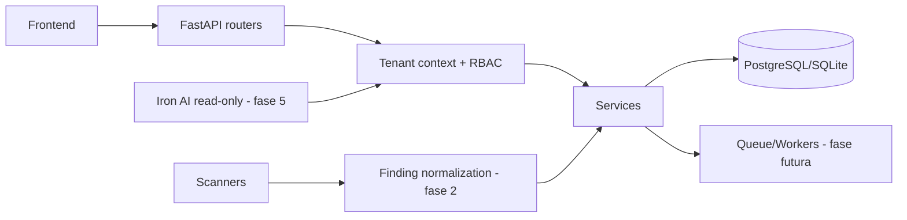

# IronNet — auditoria arquitetural e plano de migração

## Estado atual

- Backend FastAPI em `backend/main.py`, com muitas rotas e tarefas de negócio concentradas no módulo principal.
- SQLAlchemy com SQLite local/PostgreSQL em produção. O schema legado é criado/alterado em runtime; não havia controle de versão de migrations.
- `User` é o principal escopo de dados. Scans e monitoramento usam `user_id`; não havia organização, membership ou RBAC multi-tenant centralizado.
- Scanners existentes estão em `backend/scanners/` e devem ser preservados como sensores. Seus formatos ainda não são um contrato comum de findings.
- Frontend é estático, servido pela API, com dashboard e páginas de ferramentas. A nova navegação de postura deve ser adicionada progressivamente.
- Autenticação JWT possui sessão única e controle de acesso inicial. A autorização por domínio ainda é distribuída entre rotas.

## Riscos encontrados

1. Isolamento por usuário não é equivalente a isolamento por organização; sem um contexto de tenant, IDOR pode surgir em novas rotas.
2. Rate limiting e estados operacionais em memória não são consistentes entre múltiplas instâncias.
3. `create_all` e `ALTER TABLE` ad hoc não oferecem histórico, revisão ou rollback de schema.
4. Há artefatos locais de banco, logs e documentos de operação no repositório; devem ser retirados do tracking após avaliação, rotação de credenciais e definição de retenção.
5. Há ferramentas ofensivas/experimentais no mesmo produto principal; devem ficar atrás de permissões, feature flags e navegação Advanced.
6. O exemplo de ambiente continha uma chave com aparência de segredo. Ele foi substituído por placeholder; qualquer chave já usada deve ser rotacionada.

## Arquitetura alvo incremental

## Tabela de migração

| Atual | Problema | Destino | Mudança | Prioridade |
|---|---|---|---|---|
| `User` como escopo | Não representa empresa | `Organization` + `OrganizationMember` | Membership e papéis owner/admin/analyst/viewer | P0 |
| `user_id` espalhado | Autorização inconsistente | `TenantContext` | Toda rota nova valida membership no backend | P0 |
| `create_all`/ALTER em runtime | Schema não versionado | `migrations/` | Migration 001 idempotente e backfill legado | P0 |
| Scans em formatos diversos | Correlação difícil | `ScanJob`, `Finding`, fingerprint | Adaptadores na fase 2 | P1 |
| Dashboard orientado a ferramentas | UX técnica demais | Overview/Assets/Risks | Redesign na fase 4 | P1 |
| IA inexistente como domínio | Risco de contexto inventado | Tools + context + guardrails | Read-only na fase 5 | P1 |
| Rate limit em memória | Falha horizontal | Redis | Fase 6 | P2 |

## Modelo atual versus alvo

O legado mantém `users`, `scans`, monitoramento, pagamentos e rotas existentes. A migration 001 adiciona `organizations`, `organization_members`, `assets`, `scan_jobs`, `findings`, `finding_evidence`, `remediation_tasks`, `audit_logs` e `security_snapshots`. O backfill cria uma organização privada para cada usuário legado; novos cadastros já nascem com organização e membership owner na mesma transação.

## Arquivos refatorados primeiro

1. `backend/models/saas.py`, `services/tenant.py` e `services/audit_service.py` — fundação de domínio e autorização.
2. `migrations/001_saas_foundation.py` e `migrations/run.py` — schema reproduzível.
3. `backend/routes/saas_routes.py` e `backend/main.py` — API de organizações, ativos e probes.
4. `backend/routes/auth_routes.py` — bootstrap seguro da organização.

## Fases e commits sugeridos

- `foundation: add versioned SaaS schema and tenant context`
- `foundation: bootstrap organizations during registration and backfill legacy users`
- `foundation: expose scoped assets and audit events`
- `security-data: normalize scanner findings and deduplicate fingerprints`
- `risk: add deterministic scoring and snapshots`

## Critérios de aceite da Fase 1

- Usuário autenticado sem membership não acessa dados SaaS.
- `X-Organization-ID`, quando usado, só seleciona uma organização da qual o usuário é membro.
- Viewer não cria ativos; analyst/admin/owner podem criar.
- Consultas de ativos sempre incluem `organization_id` no backend.
- Migration pode ser executada duas vezes sem duplicar schema ou memberships.
- `/api/health` e `/api/ready` não expõem detalhes internos.
